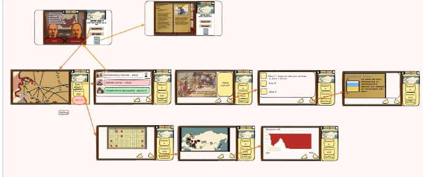
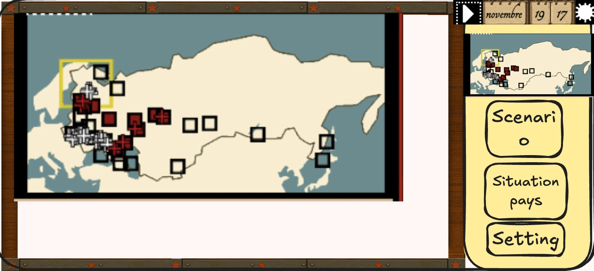
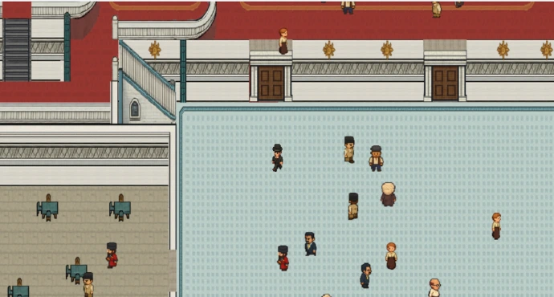

## Bonjour,

Le développement du jeu continue, et j’aimerais vous tenir informés de son avancement. Peu de grosses nouveautés ce mois-ci, mais tout de même des évolutions intéressantes à partager.

## Penser “mobile” plutôt que “PC”

Au mois de Mars, j’ai eu l’occasion de faire tester le jeu chez un ami (merci Gabriel)— et ça a été une vraie révélation.

Comme vous le savez, mon objectif est de créer un jeu mobile. Pourtant, jusqu’ici,**je pensais encore trop “PC”.**

Dans la première version, le jeu était structuré autour de deux écrans principaux : un écran de stratégie et un écran de scénario. Résultat : sur un petit écran de smartphone, tout devenait trop chargé. Les éléments étaient trop petits, l’interface encombrée, et les changements de menus rendaient l’ensemble difficile à lire.

_Nouvelle structure des écrans_

Par exemple, j’ai dû renoncer à afficher les soldats sur la mini-carte : sur mobile, cela devenait simplement une bouillie de pixels.

J’ai donc dû changer d’approche **et penser “mobile”**,c'est à dire ne plus concentrer toutes les informations sur un seul écran, mais les répartir sur plusieurs écrans.

Cette nouvelle organisation me donne finalement plus de liberté. Je peux désormais proposer :

- une carte plus lisible avec les soldats,
- des graphiques montrant l’évolution du nombre de villes occupées par chaque camp,
- ou encore des affiches de propagande plus grandes, accompagnées de leur contexte.

_Cette image montre la carte avec ville et soldat. On voit que la version "mini" à gauche est une vrai bouillie de pixel pour identifier les soldats (représenté par des croix). A l'inverse quand la carte est plus grande (à gauche), elle est beaucoup plus lisible. C'est la plus value de penser avec plusieurs écrans_

## ⚖️ Repenser les scénarios et les interruptions

Le deuxième point concerne les scénarios. J'ai eu une discussion avec un autre testeuse (Merci Laura)

Dans la version actuelle, le joueur est très rapidement interrompu par des notifications demandant au joueur de faire des choix politiques. C’est logique sur le fond : ces choix influencent la stratégie, les ennemis et les ressources.

Mais en pratique, cela casse le rythme.

Il devient difficile de rester concentré sur la stratégie quand on est constamment interrompu par des décisions politiques.

J’ai donc revu ce système.

Désormais :

- Les choix politiques sont signalés, mais restent **facultatifs**.
- Ils sont **limités dans le temps** : chaque choix n’est disponible qu’une minute (alors qu'avant le jeu se mettait en pause si on n'avait pas tranché le débat)

Chaque décision reste liée à un contexte historique précis. Par exemple, la question de l’indépendance de la Finlande apparaît en novembre 1917, conformément à la réalité

L’idée est simple : lors de la première partie, le joueur participera sans doute à peu de débats. Mais au fil des parties, il prendra conscience des choix possibles et de leurs conséquences.

## 🤖 Refonte de l’IA ennemie

Pour avril, je me concentre sur un autre sujet : l’intelligence artificielle des ennemis.

### 🔧 Fonctionnement actuel

Pour comprendre l'évolution, il faut que je vous parle de mon IA tel qu'elle est constuirte actuellement.

Pendant la partie, chaque camp ennemis reçoit une attitude défini par le scénario.

- **Inactif** : ne réagit que s’il est attaqué
- **Limité** : agit uniquement dans une zone précise (ex : mouvements indépendantistes comme les ukrainiens ou finlandais)
- **Actif** : opère sur toute la carte (ex : Russes blancs, forces étrangères)

Ensuite, j’utilise un arbre de décision combiné à des variables aléatoires.

Régulièrement, chaque camp analyse :

- ses troupes et ses villes,
- les forces alliées à proximité,
- les ennemis proches.

En fonction de ces éléments, il a plus ou moins de chances d’attaquer une ville ennemie, de produire des troupes ou d’attaquer une troupe ennemie, avec une part d’aléatoire.

Par exemple, s’il y a des forces alliées à proximité, il y a 80 % de chances d’attaquer une ville ennemie, tandis que dans le cas inverse, il y a 80 % de chances d’attaquer une troupe ennemie.

Ce système fonctionne… mais c’est devenu un vrai “plat de spaghetti” à maintenir.

J’ai notamment deux bugs importants :

- les Japonais attaquent l’ouest de la Russie au lieu de rester vers Vladivostok
- les forces blanches restent parfois totalement immobiles

## 🔄 Vers une IA de type GOAP

Dans une logique de simplification, j’explore maintenant une nouvelle approche : le modèle **GOAP**pour remplacer la modèle d'arbre de décision.

GOAP signifie Goal-Oriented Action Planning - Planification d'Actions Axée sur les Objectif.

Le principe est le suivant : On définit pour l'IA **un objectif** qui change en fonction de l’environnement (par exemple, beaucoup d’ennemis impose une politique défensive, tandis que peu d’ennemis favorise une politique offensive).

On définit ensuite **des d’actions.**

Ces actions doivent pouvoir être utilisées dans différentes chaînes. Par exemple, si on a les actions "créer des troupes", "lancer les troupes à l'attaque", "explorer"

On peut définir comme plan

- créer une troupe → explorer
- créer des troupes → créer des troupes → créer des troupes → lancer les troupes à l'attaque

Enfin, il y a le plan.

L’idée est que l’IA puisse elle-même construire son propre plan, c’est-à-dire sa chaîne d’actions.

Deux approches sont possibles :

- soit on écrit plusieurs plans et on demande à l’IA de choisir le plus pertinent
- soit on demande à l’IA de tester différentes combinaisons d’actions pour voir si elles permettent d’atteindre l’objectif

Et c’est là que quelque chose d’intéressant apparaît : **l’émergence**.

## ✨ L’émergence : le Graal

Imaginons :

Le développeur définit des actions

- créer des troupes
- déplacer des troupes
- construire des routes

Et soudain, l’IA décide seule que construire une route est la meilleure façon d’atteindre un objectif militaire.

Dans l'esprit du développeur l'action "construire des routes" n'a pas été imaginé pour une action militaire mais plutôt économique. Mais comme l'IA teste toute les actions avec toutes les autres, elles peut aboutir à des plans qui n'avaient pas été pensé par le developpeur en combinant par exemple "constuire des routes" et "déplacer des troupes". Ce comportement n’a pas été explicitement programmé.

On retrouve ce type de logique dans certains jeux où des PNJ bloquent une route avec des objets plutôt que d’attaquer directement.

C’est ce type d’intelligence “imprévisible mais cohérente” que j’aimerais atteindre.

## ⚠️ Les limites techniques

Le problème, c’est que j’utilise GDevelop, qui repose sur un système proche du pseudo-code.

Cela rend l’implémentation d’un système GOAP complexe.

Je dois encore faire plusieurs tests pour voir si une version fonctionnelle est possible.

Mon idée actuelle serait d’ajouter cette logique comme une couche supplémentaire, pour gérer la stratégie locale. Ou alors d'utiliser le GOAP dans un mini jeu présent dans le jeu, "participer au congrès de Bakou". J'en parlerais plus tard.

_Screenshot du minijeu "Participer au congrès de Bakou"_

J'ai eu beaucoup de mal à saisir le GOAP et c'est vraiment grace à ma partenaire qui m'a encouragé que j'ai pu y arriver (Merci Holly)

## 🎯 Conclusion

Voilà où en est le projet aujourd’hui.

Beaucoup de réflexion, des ajustements importants, et une direction qui se précise.

L’objectif reste inchangé :

👉 une sortie du jeu cet été.
