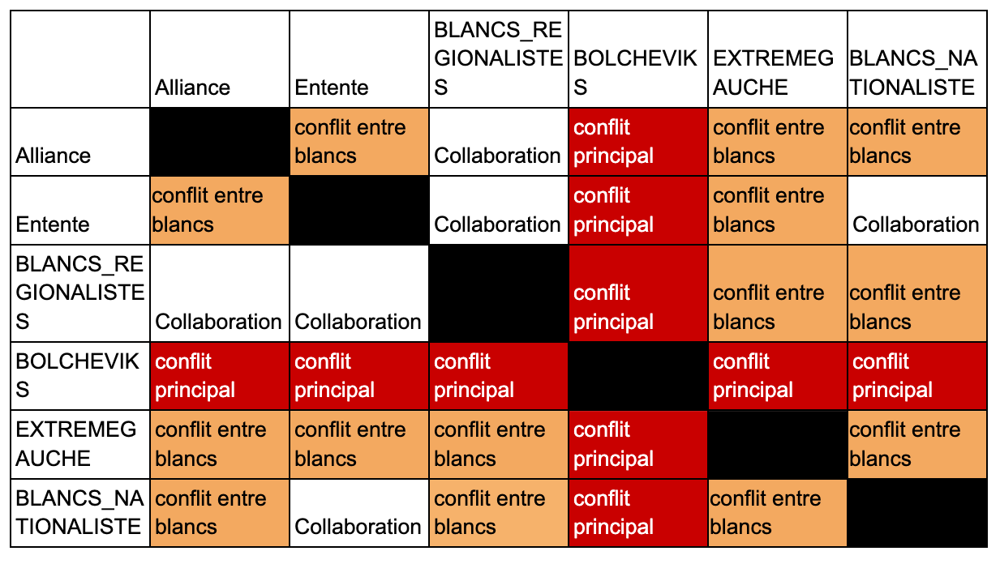
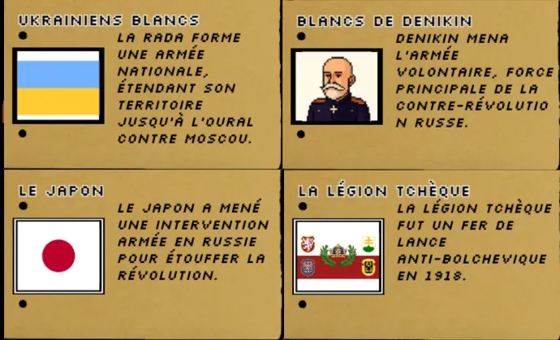
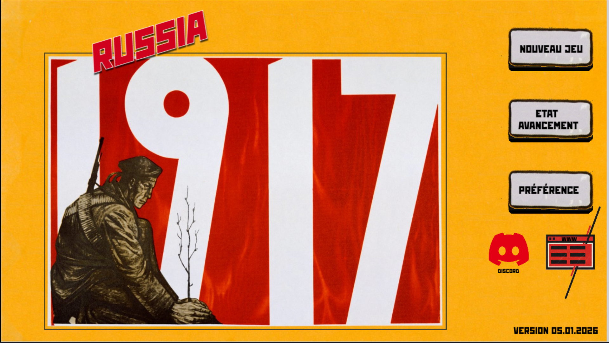

Voici un nouveau point sur le développement de **Russia 1917** pour le mois de décembre 2025.

Ce mois a été largement consacré à une question centrale et délicate : **l’équilibrage du jeu**, notamment depuis la refonte complète de l’IA des forces blanches entamée en novembre.

## ⚙️ IA des forces blanches : la dernière pièce du puzzle

En novembre, j’expliquais avoir entièrement réécrit l’IA des forces blanches.

Il restait cependant une fonction essentielle à implémenter : **la capacité pour certains camps blancs de créer de nouvelles troupes**.

C’est désormais chose faite.

Tous les camps blancs peuvent produire des unités, **à l’exception des forces étrangères** — Français, Britanniques, Américains, Allemands, Japonais et Légion tchèque — qui n’ont historiquement pas vocation à créer de nouvelles troupes composées de Russes.

## ⚠️ Un déséquilibre majeur… et un paradoxe

L’ajout de cette fonctionnalité a cependant provoqué un **déséquilibre massif** du jeu.

Dans l’état actuel, il devient presque impossible de gagner côté bolchevik.

Dans certaines parties (comme dans l'exemple ci-dessus), les forces blanches deviennent non seulement écrasantes en nombre, mais les villes perdent quasiment toute capacité de production d’unités bolcheviques.

Et c’est là tout le paradoxe :

- Dans la version précédente, **les bolcheviks étaient les seuls à pouvoir produire des unités**. → La victoire à long terme était alors relativement facile, avec un potentiel total de **280 unités à créer contre 270 qui apparaissaient coté blanc**.
- Désormais, les forces blanches peuvent **occuper durablement une ville**, en consommer toutes les ressources en produisant des troupes supplémentaires, et ces ressources sont **perdues définitivement** pour les bolcheviks, puisque la capacité de production ne se régénère pas.

## 📊 Quelques chiffres pour comprendre

Si l’on fait un calcul simple :

- Les bolcheviks reçoivent spontanément **13 nouvelles unités**.
- Les différents camps blancs reçoivent spontanément **207 unités**.

Ces chiffres correspondent aux interventions étrangères historiques (70 000 Japonais, 30 000 hommes de la Légion tchèque, etc.),

En considérant qu’**une unité représente environ 1 000 hommes**.

Il reste ensuite un « gâteau » théorique de **280 unités** (10 par ville) à se partager.

On comprend rapidement que **l’équilibre est extrêmement difficile à maintenir** pour les bolcheviks car les blancs peuvent très vite atteindre 300 à 350 unités et les bolcheviks automatiquement moins.

Historiquement, l’Armée rouge comptait pourtant **plus d’un million d’hommes** à la fin de la guerre civile. Mais pour des raisons techniques évidentes, il est impossible de faire évoluer **1 000 unités simultanément** dans le jeu. Il y a donc un besoin de rééquilibrer les forces entre elles.

## 🛠️ Tentatives de rééquilibrage

Pour faire face à cette situation, plusieurs limites ont été introduites.

### 🔒 Limitation du nombre de troupes blanches

Chaque camp blanc dispose désormais d’un **nombre maximal d’unités simultanées**.

Par exemple, les forces finlandaises sont limitées à **20 unités**, afin d’éviter qu’une seule faction ne vide complètement les ressources d’une ville.

### 🏙️ Failles dans la défense des villes

L’IA blanche protège encore imparfaitement ses villes.

Cela ouvre une opportunité au joueur bolchevik : **occuper temporairement une ville abandonnée** pour tenter de récupérer des ressources et produire de nouvelles troupes.

## ⚔️ Conflits internes entre forces blanches

Un autre levier important a été ajouté : **les conflits entre camps blancs**.

Historiquement, tous les ennemis des bolcheviks ne formaient pas un bloc uni :

- Allemands et Britanniques se sont affrontés,
- la Makhnovchtchina combattait les nationalistes ukrainiens,
- les anarchistes de Kronstadt n’auraient jamais coopéré avec les armées de Dénikine,
- et bien d’autres cas encore.

Il était donc nécessaire d’introduire **alliances, collaborations et conflits internes**.

## 🧩 Typologie des camps

Les camps sont désormais organisés en grandes catégories :

- **ALLIANCE** → Allemands
- **ENTENTE** → Américains du Nord, Britanniques (Nord et Caucase), Français du Sud, Japonais, Légion tchèque
- **BLANCS RÉGIONALISTES** → Biélorusses, Finlandais, Ukrainiens, Polonais, Baltes
- **BLANCS NATIONALISTES** → Dénikine, Koltchak, Ioudenitch, Kerenski
- **EXTRÊME GAUCHE** → Verts paysans, Makhnovchtchina, Anarchistes de Kronstadt
- **BOLCHEVIKS**

Voici un tableau des conflits entre chaque groupes

Ces affrontements internes réduisent mécaniquement la pression exercée sur les bolcheviks.

## 🌏 Points de vigilance

L’équilibrage reste cependant fragile, notamment :

- en **Sibérie**,
- et en **Extrême-Orient**, où les Japonais et la Légion tchèque sont très nombreux et ne s’affrontent pas encore entre eux.

Je n’exclus pas :

- d’augmenter le nombre de troupes bolcheviques disponibles,
- notamment dans les grandes villes comme **Moscou** et **Petrograd**, qui en tant que grandes villes ont plus de ressources disponibles que des villes secondaires.

Je souhaite également **récompenser certaines décisions politiques** par l’arrivée de nouvelles troupes. Par exemple la mise en place des décrets de la terre ou de la paix pourraient provoquer la création spontanée de troupes dans différentes villes.

## 🧠 Autres avancées de décembre

### ℹ️ Infobulles et documentation

Un nouveau système d’infobulles a été ajouté, fournissant des informations détaillées sur chaque camp blanc, parfois accompagnées des photos des personnages.

_(On appréciera les fiches perforées 😉 pour donner un style d'époque)_

Les informations sont issues notamment de :

- _The History of the Civil War in the U.S.S.R._ (Moscou, 1936),
- et des œuvres complètes de Lénine.

J’ai également testé des **portraits en pixel art** (Dénikine, Koltchak…).

Même si cela pose question : il ne faut pas **humaniser ou rendre attachantes** des forces fondamentalement réactionnaires, voire proto-fascistes.

### 🚆 Déplacements sur le rail

Enfin, les troupes bolcheviques suivent désormais correctement les **lignes de chemin de fer sur de longues distances**.
Une petite vidéo illustre cette amélioration.

[Voir la vidéo sur YouTube](https://www.youtube.com/watch?v=lPmsVeQwRsw)

## 🔧 Prochaines étapes

- Corriger plusieurs bugs, notamment :
  - Dénikine, Koltchak et Ioudenitch encore trop statiques dans les combats.
- Empêcher certaines forces de quitter leur zone d’action (des Japonais ont tenté de marcher sur Moscou lors d'une partie).

Avant la publication sur le Play Store, il reste deux chantiers majeurs :

### 🏁 La fin du jeu

La partie se termine en **janvier 1922**, avec la création de l’URSS.

L’objectif est de comparer l’URSS créée par le joueur :

- à la réalité historique,
- mais aussi aux **autres URSS possibles**.

Une URSS ayant pris Varsovie et relié Berlin ne serait évidemment pas la même qu’une URSS réduite à Moscou et Petrograd.

Le défi est de donner envie de **rejouer** pour découvrir plusieurs issues.

### 🏛️ Les décisions politiques

Chaque mois, le joueur participera à des discussions internes au Parti bolchevik et devra prendre position :

- D'accord avec l'accord de Brest-Litovsk ?
- Mise en place du communisme de guerre ?
- Création de la Tcheka (police politique) ?

Le jeu expliquera les conséquences de chaque choix, afin de replacer le joueur dans un contexte comparable à celui des dirigeants bolcheviks — et de réfléchir à ce qui aurait pu être fait autrement, et à quel prix.

[N'hésitez pas à tester le jeu ici](https://gd.games/antmdh/russia-1917)

