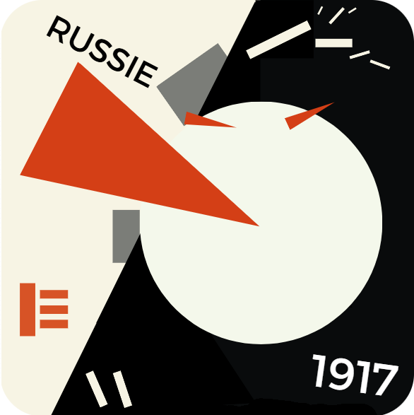
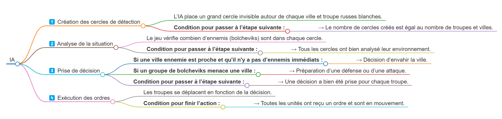

Je travaille en ce moment sur un jeu qui se déroule en Russie en 1917, en pleine guerre civile. Le joueur incarne les bolcheviks, mais j’ai besoin d’une intelligence artificielle qui prendra le contrôle des armées blanches, ces forces opposées aux bolcheviks qui tentent de reprendre le contrôle du pays.

**L’objectif du jeu ?** Déplacer ses troupes, conquérir des villes stratégiques et affronter l’ennemi. Pour que cela soit intéressant, il fallait que l’IA des armées blanches soit capable de prendre des décisions militaires cohérentes.

**Le problème :** GDevelop, le moteur que j’utilise pour produire le jeu, ne gère pas naturellement les intelligences artificielles complexes. J’ai donc dû trouver une méthode fiable pour que l’IA fonctionne étape par étape, sans provoquer de bugs.

## L’IA des armées blanches : une stratégie militaire par étapes

Dans mon jeu, l’armée blanche doit travailler par étapes :

1. détecter les villes libres à conquérir ;
2. évaluer la menace bolchevique à proximité ;
3. choisir d’attaquer ou de se renforcer ;
4. déplacer ses troupes intelligemment.

Pour que tout fonctionne correctement, j’ai mis en place une méthode logique et bien structurée. Voici comment l’IA prend ses décisions :

- elle commence par créer un cercle de détection invisible autour de chacune de ses villes et unités ;
- si un soldat ennemi entre en contact avec l’un de ces cercles, cela signifie qu’il est à proximité et représente une menace ;
- l’IA repère alors les troupes les plus proches de cet ennemi et leur donne l’ordre de l’attaquer ;
- si aucun ennemi n’est détecté, l’IA envoie ses unités conquérir une nouvelle ville pour étendre son territoire.

_L’icône du jeu « Russia 1917 » utilisée au moment de cet article._

## Le piège classique de GDevelop : tout s’exécute en même temps

Au début, j’avais écrit mon IA de cette manière :

1. créer des cercles de détection autour des villes et des troupes ;
2. passer à l’étape suivante pour identifier les ennemis ;
3. passer à l’étape suivante pour choisir une action ;
4. passer à l’étape suivante pour déplacer les troupes.

En théorie, cela paraît propre. En pratique ? Un carnage.

Pourquoi ? Parce que dire « étape = 2 » ne veut pas dire que l’étape 1 est bien terminée. L’IA se mettait donc à tout faire en même temps : créer des cercles, analyser les ennemis et déplacer les troupes au cours d’une seule image du jeu.

## La vraie solution : valider chaque action avant d’avancer

C’est la grande découverte que j’ai faite en travaillant sur cette IA :

> Il ne faut jamais simplement changer une variable pour avancer dans un processus. Il faut toujours créer une condition qui vérifie que l’action précédente est bien terminée.

Concrètement, au lieu de faire :

> ❌ « Si étape = 1, alors fais ceci et passe à l’étape 2. »

Je fais plutôt :

> ✅ « Si l’étape 1 est terminée — par exemple, si tous les cercles sont bien créés — alors seulement on passe à l’étape 2. »

_L’IA en action : création des cercles de détection, analyse de la situation, prise de décision et exécution des ordres._

## Pourquoi cette méthode est essentielle

Avec cette approche, l’IA ne se précipite pas et fonctionne de manière fluide. Chaque action est entièrement terminée avant de passer à la suivante, ce qui évite les bugs où tout s’exécute en même temps.

Et cela change tout :

- l’IA semble plus intelligente, car elle réagit progressivement à ce qui se passe ;
- les bugs où toutes les actions se déclenchent simultanément disparaissent ;
- le jeu devient plus stratégique, car les armées blanches répondent réellement aux actions du joueur.

## Conclusion : une technique à retenir pour GDevelop

Si vous souhaitez réaliser une IA efficace dans GDevelop, ou même structurer un algorithme complexe, retenez ceci :

> Ne faites jamais seulement « étape = 2 ». Vérifiez toujours que l’étape 1 est bien terminée avant de continuer.

C’est la clé pour éviter que GDevelop exécute tout en même temps et pour créer une IA fluide, logique et stratégique.

Maintenant que j’ai réussi à structurer ce système, je vais pouvoir ajouter encore plus d’intelligence aux armées blanches. Peut-être même leur donner des stratégies plus avancées, comme des attaques coordonnées ou des retraits tactiques…
