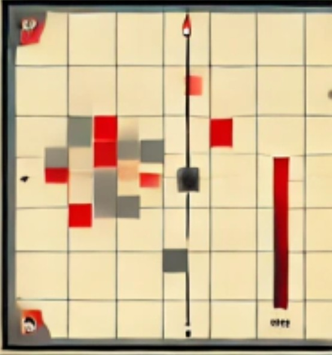
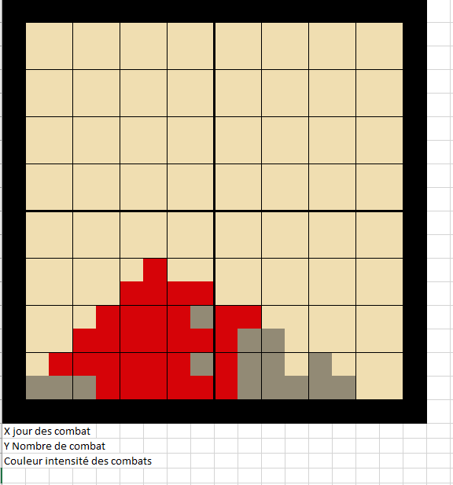
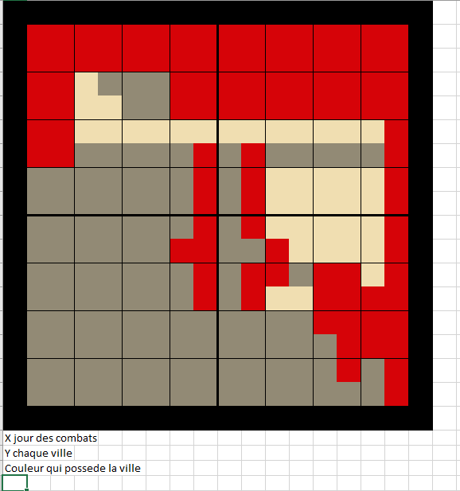
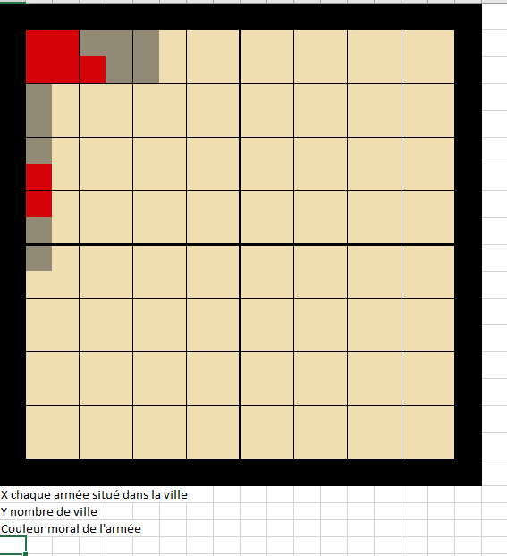
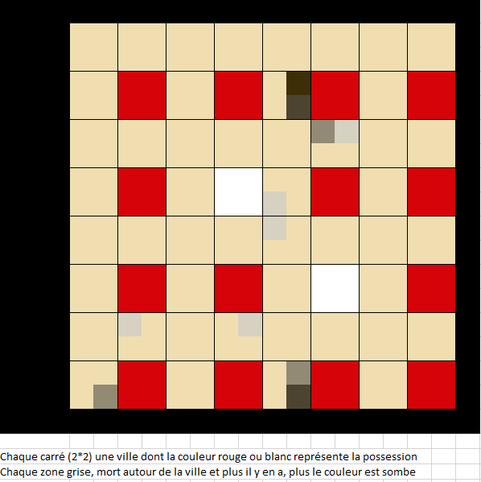

Dans le cadre du développement de notre jeu **Russia 1917**, nous avons cherché à créer une esthétique visuelle forte, inspirée du constructivisme russe et de la célèbre œuvre d’El Lissitzky **« Battre les Blancs avec le coin rouge »**. Cette composition fait référence à la victoire des bolcheviks sur les armées blanches. L’un des aspects essentiels du jeu consiste à produire des graphiques à la fois beaux, lisibles et cohérents avec cette direction artistique.

L’objectif du jeu est simple : déplacer des armées pour contrôler des villes, recevoir des renforts et conquérir le territoire. Cependant, l’ajout d’éléments stratégiques spécifiques complexifie le gameplay.

Le chemin de fer transsibérien impose par exemple un combat linéaire et limite les options tactiques. Des forces étrangères tentent également de conquérir le territoire et soutiennent les armées blanches.

Le joueur doit aussi prendre des décisions politiques. Le développement de l’Internationale permet de recevoir le soutien des ouvriers des pays occidentaux et ainsi d’affaiblir les interventions étrangères. Le Congrès des peuples d’Orient, organisé à Bakou en 1920, peut contribuer à unir les peuples du sud de la Russie. La signature du traité de Brest-Litovsk ou la décision d’attaquer la Pologne jouent également un rôle important.

## À la recherche d’une représentation visuelle appropriée

Nous avons exploré différentes représentations qui pourraient à la fois informer les joueurs sur le déroulement de la guerre et proposer un visuel marquant, reflétant le caractère stratégique du jeu.

Nous sommes partis d’une première génération d’image :

Voici quelques pistes que nous avons ensuite explorées.

### Représenter l’intensité des combats

Un graphique en grille où l’intensité des combats est représentée par des couleurs allant du gris au rouge vif. Cela permet de visualiser immédiatement les zones de conflit majeures.

### Montrer le contrôle des villes au fil du temps

Un système de représentation montre le contrôle progressif des villes par les factions rouges et blanches, symbolisé par des blocs de couleurs différenciées.

### Représenter le moral des armées

Un autre graphique représente le moral des armées en fonction de leur position et des villes occupées, ajoutant une dimension supplémentaire à la stratégie.

## Les prochaines étapes

Nous n’avons pas encore trouvé l’angle parfait qui associe toute l’information nécessaire à la beauté visuelle recherchée. Ces essais constituent néanmoins une base solide pour affiner notre approche.

Notre objectif est de parvenir à une représentation qui donne l’impression d’îlots isolés de conflit, tout en conservant une esthétique cohérente avec l’esprit d’El Lissitzky.

Le développement visuel de **Russia 1917** est un processus fascinant qui mêle histoire, stratégie et art graphique. Nous sommes convaincus que cette fusion entre fonctionnalité et esthétique créera une expérience immersive et singulière pour les joueurs.

## Mise à jour

Je pense avoir trouvé la bonne présentation. Chaque carré sur la carte représente une ville : le rouge ou le blanc indique la faction qui la contrôle. Les zones grises qui l’entourent représentent le nombre de victimes ; plus la couleur est sombre, plus les pertes sont importantes.

[Inscrivez-vous à notre newsletter](/fr/newsletter/) pour suivre les prochaines étapes du développement de Russia 1917.
