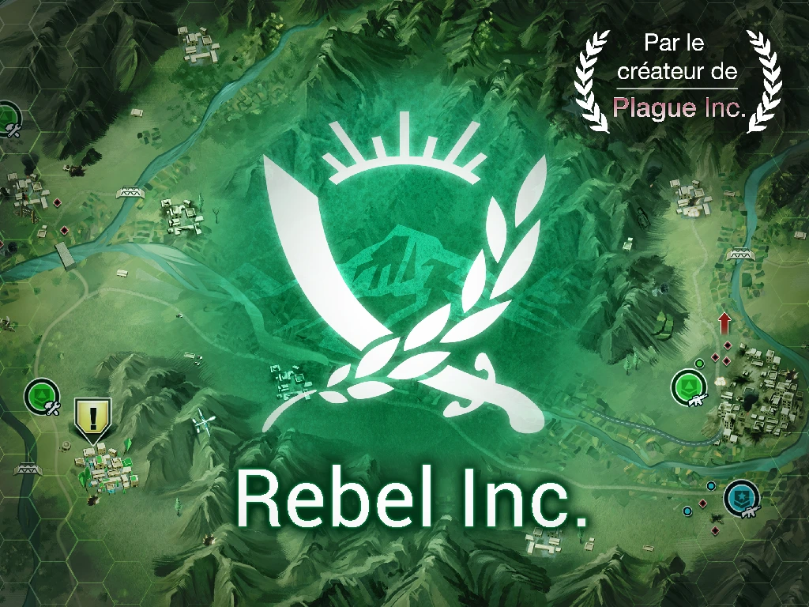
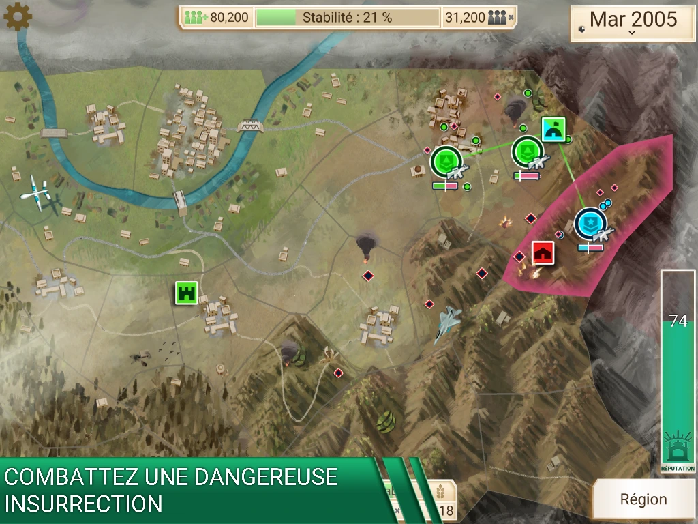
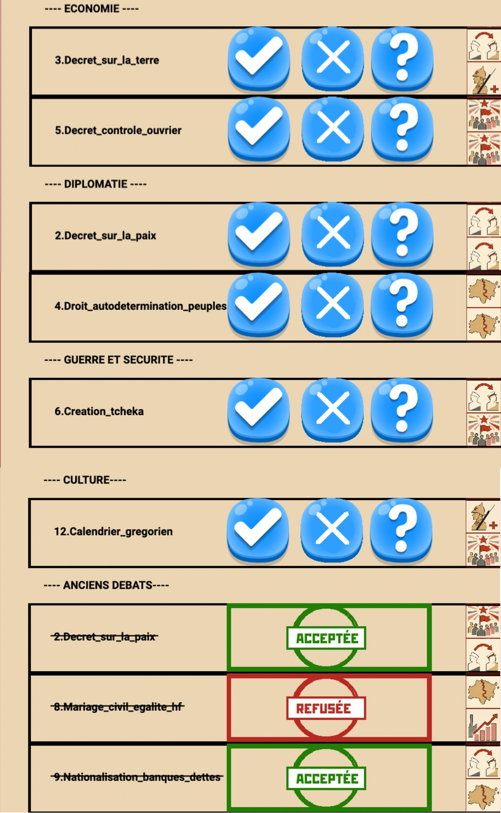
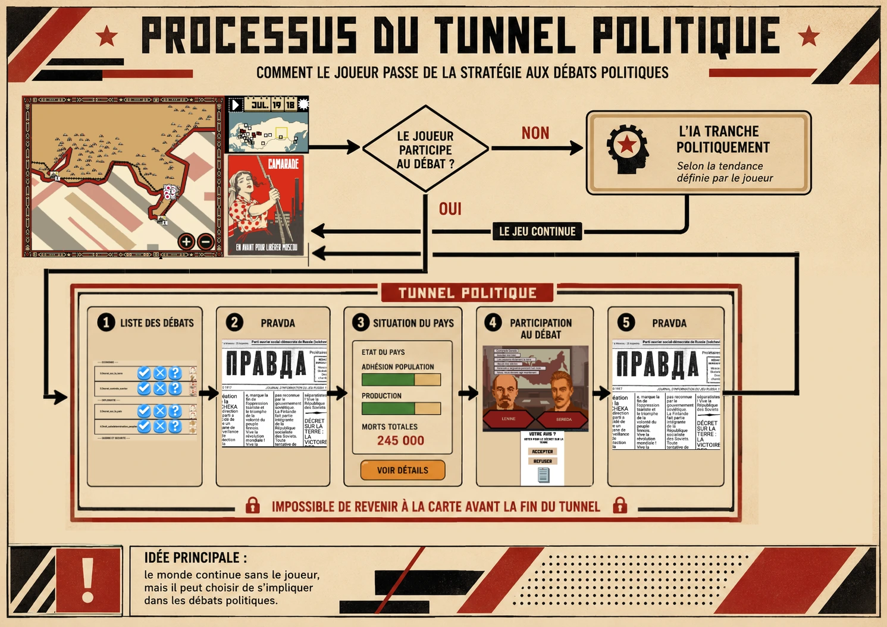

Bonjour à toutes et à tous,

Voici un nouveau point sur le développement de **Russia 1917** et sur les principaux sujets auxquels je me suis consacré durant le mois de juin 2026.

## Une rencontre enrichissante

J’ai eu la chance de rencontrer **[Landry](https://www.youtube.com/@landrygd)**, un youtubeur spécialisé dans la création et la production de jeux vidéo.

Il a pu tester **Russia 1917** et me faire un retour très intéressant sur le projet. Cette rencontre m’a permis de bénéficier de précieux conseils, mais aussi d’un regard extérieur sur les mécaniques de jeu et sur l’expérience proposée aux joueurs.

_Le youtubeur Landry_

## Repenser le gameplay de la carte stratégique

Ce mois-ci, j’ai principalement travaillé sur la dynamique centrale du jeu : la **carte stratégique**, sur laquelle le joueur déplace ses unités et mène les opérations militaires.

Sur mobile, cette mécanique provoque encore beaucoup de frictions. Il arrive par exemple que le joueur ne parvienne pas à sélectionner ou à déplacer l’unité souhaitée dès la première tentative. Le niveau de zoom peut également changer de manière intempestive, ce qui rend certaines actions imprécises ou frustrantes.

Pour tenter de résoudre ce problème, j’ai expérimenté un système inspiré du jeu mobile **Rebel Inc.**

_Screenshots du jeu Rebel Inc. Cliquez sur l'image pour y avoir accès._

Dans ce jeu, qui raconte l’histoire d’une armée d’occupation de type OTAN intervenant dans un pays inspiré de l’Afghanistan, les unités ne se déplacent pas librement sur la carte. Elles passent d’une zone à une autre. Lorsqu’une unité du joueur et une unité ennemie se trouvent dans la même zone, un affrontement commence.

C’est d’ailleurs un très bon jeu pour comprendre certaines dynamiques de l’impérialisme et de l’occupation militaire. Il est disponible gratuitement sur mobile.

Dans **Rebel Inc.**, la carte comprend généralement une trentaine de zones. Il n’est pas nécessaire de zoomer et toutes les zones ont approximativement la même taille.

J’ai donc testé cette méthode dans **Russia 1917**, d’abord avec une carte divisée en **28 zones**, puis avec une version comprenant **83 zones**.

### Le problème de l’échelle géographique

Cette approche m’a rapidement confronté à plusieurs difficultés.

Pour rester cohérent historiquement, je dois distinguer certains territoires. Il serait par exemple difficile de réunir dans une même zone la Finlande, les États baltes et la Pologne, car ces régions ont des situations politiques et militaires très différentes.

Le problème est que cela aboutit à des zones de tailles extrêmement inégales.

Sur la carte comprenant 28 zones, la région du Turkménistan est par exemple environ 24 fois plus grande que la zone regroupant les États baltes.

La guerre civile russe s’est déroulée sur un territoire immense, composé à la fois de régions très vastes et peu peuplées, et de territoires beaucoup plus petits, mais politiquement ou stratégiquement essentiels. Il est donc difficile de créer un découpage à la fois lisible, équilibré et historiquement pertinent.

### Une carte à 28 zones

Avec 28 zones, le jeu conserve une véritable dimension stratégique et reste relativement facile à comprendre.

Cependant, cette simplification limite fortement les possibilités du joueur. Une seule unité peut généralement occuper chaque zone. Le transport ferroviaire perd une grande partie de son intérêt et il devient impossible de contourner une armée ennemie ou de progresser derrière ses lignes.

La stratégie devient donc plus lisible, mais aussi beaucoup moins riche.

### Une carte à 83 zones

Avec 83 zones, les possibilités tactiques sont plus nombreuses, mais l’expérience devient rapidement répétitive.

Le joueur passe beaucoup de temps à déplacer des unités d’une zone à une autre, puis à attendre la résolution des affrontements. La carte devient également moins lisible, en particulier sur un écran de téléphone.

Cette solution permet davantage de précision, mais elle ne règle finalement pas les principaux problèmes de confort de jeu.

J’ai donc décidé de revenir à mon idée initiale : une **carte libre**, sur laquelle chaque unité peut se déplacer vers un endroit précis.

Mon objectif est maintenant de conserver cette liberté tout en réduisant les frictions liées à la sélection des unités, aux déplacements et au zoom.

## Le principal défi de game design : le menu des débats

J’en arrive maintenant à l’un des sujets les plus importants du projet : le **menu des débats politiques**.

Pour rappel, l’objectif principal de cette mécanique est d’encourager le joueur à interrompre temporairement ses activités militaires afin de participer à des débats politiques qui influenceront directement la partie stratégique, mais aussi son bilan final.

Je ne souhaite cependant pas obliger artificiellement le joueur à s’y rendre à l’aide de timers contraignants, de points à dépenser ou de sanctions arbitraires.

L’idée est que le joueur choisisse lui-même :

- s’il souhaite participer à un débat ;
- quel débat lui semble prioritaire ;
- s’il accepte ou refuse la politique proposée ;
- et combien de ressources il est prêt à consacrer à son application.

Le joueur doit ressentir que ces débats sont importants, sans avoir l’impression que le jeu l’oblige constamment à quitter la carte stratégique.

## Une nouvelle organisation du menu politique

Pour améliorer cette partie du jeu, j’ai entièrement revu le menu consacré aux débats.

Auparavant, le joueur devait choisir entre cinq boutons, puis consulter séparément les différents débats disponibles.

Désormais, les débats apparaissent directement dans une liste organisée par thème. Seuls les débats actuellement disponibles sont affichés.

Chaque débat est accompagné d’icônes indiquant les types de conséquences qu’il peut provoquer : changements territoriaux, décisions militaires, effets économiques, évolution politique ou influence idéologique.

Les débats déjà terminés apparaissent également en bas de la liste, accompagnés d’un cachet indiquant si la proposition a été **approuvée** ou **refusée**.

L’objectif est de permettre au joueur de comprendre rapidement quelles décisions sont en attente, quelles conséquences elles peuvent avoir et quels choix ont déjà été effectués.

_Le nouveau menu débat_

## Mieux relier la stratégie et les débats politiques

Je dois encore travailler sur la connexion entre la carte stratégique et le menu des débats.

Pour le moment, je pense m’orienter vers une progression en plusieurs étapes.

Lors de la première partie, les débats seraient résolus automatiquement par l’intelligence artificielle. Le joueur recevrait des notifications concernant les décisions prises et pourrait choisir de participer à certains débats, mais sans aucune obligation.

Après avoir terminé le jeu une première fois, il pourrait recommencer la campagne en choisissant entre plusieurs niveaux d’implication politique.

Dans un premier mode, il donnerait simplement une orientation générale à l’intelligence artificielle sur la manière de résoudre les débats.

Dans un mode plus avancé, il pourrait imposer son avis sur chaque débat. Dans ce cas, toutes les décisions politiques devraient obligatoirement être tranchées par le joueur.

Cette progression permettrait de découvrir progressivement les différentes dimensions du jeu, sans surcharger immédiatement les nouveaux joueurs.

## Un tunnel politique plus immersif

Lorsqu’un joueur décide de participer à un débat, il entre dans un véritable **tunnel politique** composé de plusieurs écrans successifs.

Une fois ce parcours commencé, il ne peut pas retourner immédiatement sur la carte stratégique. Il doit d’abord passer par chaque étape du processus, afin de consulter les informations disponibles, prendre sa décision, attribuer les ressources nécessaires et découvrir les conséquences attendues de son choix.

Le joueur commence par consulter la **Pravda**, puis le menu **Situation du pays**, qui rassemble différents rapports sur l’état politique, social, économique et militaire de la Russie. L’objectif est de l’amener à prendre une décision éclairée avant de trancher le débat.

Une fois la décision prise, il accède au menu **Économie**, dans lequel il choisit lui-même les ressources consacrées à l’application de sa politique.

Il repasse ensuite par la **Pravda**, afin de découvrir les conséquences attendues de sa décision. Ce n’est qu’après avoir parcouru l’ensemble de ces étapes qu’il peut quitter le tunnel et retourner sur la carte stratégique.

La **Pravda** reprend la mise en page du journal de l’époque. Les textes produits par le jeu, qui décrivent l’évolution de la partie et les conséquences des décisions politiques, sont intercalés parmi de véritables articles historiques de la _Pravda_.

Le joueur peut ainsi trouver, à côté d’un article consacré à ses propres décisions, un texte célébrant l’anniversaire de la Commune de Paris ou relatant une grève survenue en dehors de la Russie. Ces événements existent indépendamment de ses actions et apparaissent dans le journal quelle que soit la manière dont il joue.

Cette alternance entre les informations générées par la partie et les véritables articles de l’époque doit renforcer l’impression que le joueur évolue dans un monde historique vivant, qui ne tourne pas uniquement autour de lui.

La Pravda et le menu **Situation du pays** restent néanmoins accessibles directement depuis la carte stratégique lorsqu’aucun débat n’est en cours. Le joueur peut ainsi suivre l’évolution de la situation et comprendre les décisions prises par l’intelligence artificielle, même s’il choisit de ne pas intervenir personnellement.

Le processus des débats en schémas

## Un monde qui continue sans le joueur

À travers ce système, je souhaite transmettre plusieurs idées importantes.

La première est de placer un maximum d’informations dans les journaux du Parti et dans les rapports sur l’état du pays. Le joueur doit rechercher les informations utiles parmi des textes inspirés de l’époque, ce qui doit renforcer l’immersion historique.

La deuxième est de montrer que le joueur n’est qu’un rouage au sein d’un processus politique beaucoup plus vaste.

Les numéros de la Pravda continuent d’être publiés, même s’il ne les lit pas. Les rapports continuent d’être rédigés et les décisions politiques sont prises, même s’il choisit de ne pas s’y impliquer.

Enfin, ce système doit permettre une progression naturelle de la difficulté.

Le joueur peut terminer une première fois la campagne sans participer activement aux débats. Lors d’une nouvelle partie, il peut intervenir ponctuellement. Il peut ensuite choisir de contrôler chaque décision et de gérer précisément les ressources nécessaires à l’application de ses politiques.

Le jeu passe ainsi progressivement d’une expérience principalement stratégique à une simulation politique, militaire et économique beaucoup plus complète.

## La suite du développement

Voilà où en est actuellement le projet.

Le principal objectif des prochaines semaines sera de poursuivre le travail sur le confort d’utilisation de la carte stratégique, mais aussi de renforcer la connexion entre les opérations militaires, les débats politiques, la Pravda, les rapports sur le pays et la gestion économique.

Merci beaucoup pour votre lecture et pour votre soutien.

N’oubliez pas de vous abonner à la newsletter de **Marxist Games** pour ne rien manquer des prochaines actualités du projet.

[Inscrivez vous à la newsletter](/fr/newsletter/)
