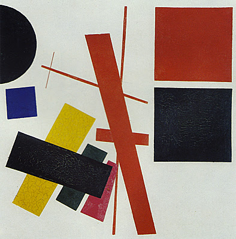
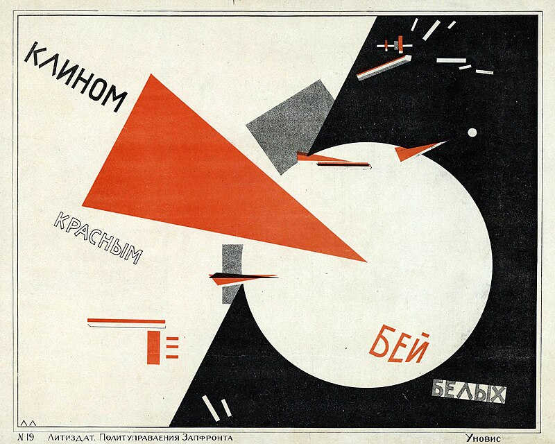
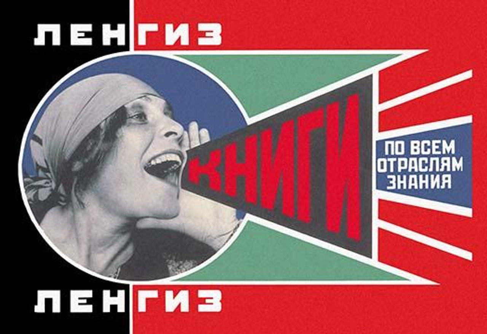
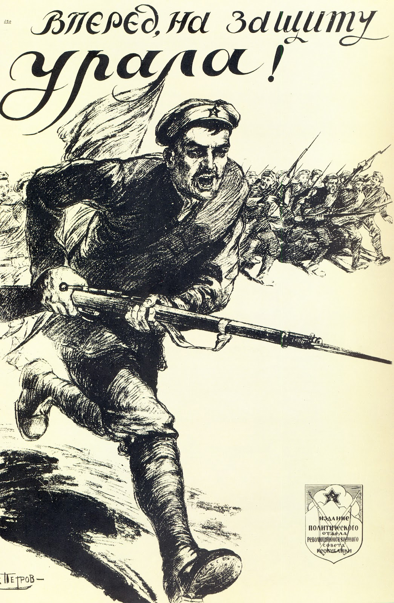
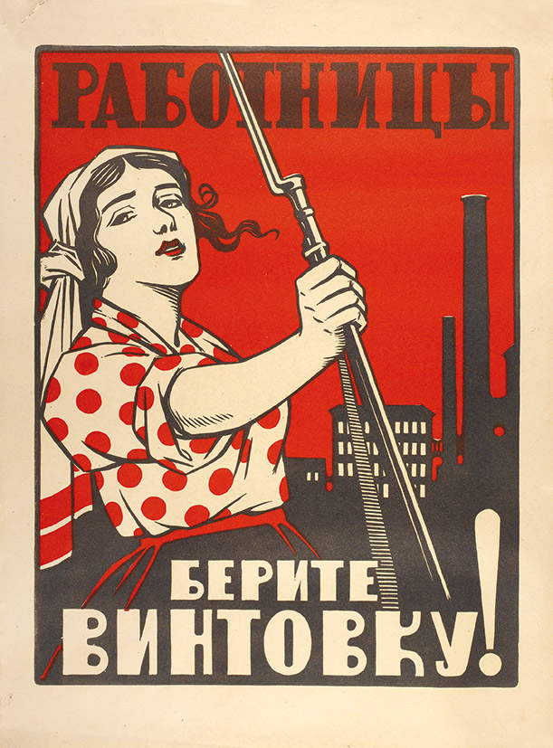
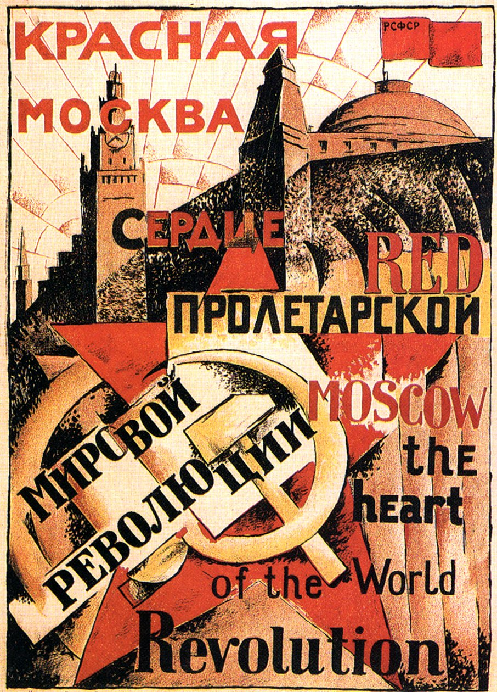
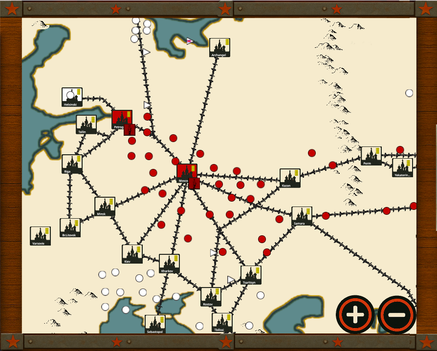
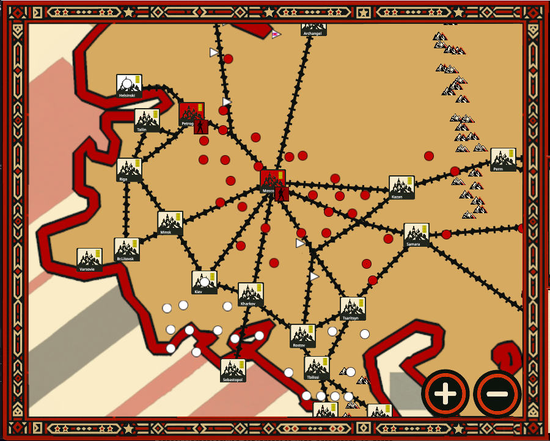

Dans le développement de notre jeu, nous avons voulu rendre hommage à l’un des mouvements artistiques les plus marquants du XXe siècle : **l’avant-garde russe**. Né dans le tumulte de la Révolution de 1917, ce courant artistique a rompu avec les canons classiques pour imposer un langage visuel audacieux, géométrique et résolument moderne.

_Sensations mélangées, 1916, Kasimir Malevitch, musée des Beaux-Arts d’Ekaterinbourg._

## L’avant-garde russe, un art révolutionnaire

Contrairement au style réaliste et détaillé de la fin du XIXe siècle, l’avant-garde privilégie les formes épurées, les contrastes saisissants et les couleurs vives. Ce mouvement ne se contente pas de bouleverser l’art : il cherche aussi à le rendre accessible à tous, dans une Russie tsariste où l’analphabétisme est massif.

Parmi ses œuvres emblématiques, on retrouve :

_« Battre les Blancs avec le coin rouge » d’El Lissitzky, symbole de l’abstraction géométrique qui évoque le combat des forces rouges bolcheviques contre les armées blanches._

_L’affiche « Lengiz » (« Des livres dans tous les domaines de la connaissance »), où le texte et l’image fusionnent pour créer un message percutant._

## Un art qui se retrouve dans les affiches de propagande

Les bolcheviks s’emparent rapidement de ce style pour leur propagande, passant d’un classicisme ampoulé à des compositions cubistes, puis à un langage visuel radicalement nouveau.

_Affiche « En avant pour la défense de l’Oural » d’Alexander Apsit, Moscou, 1919, dans un style encore classique._

_Affiche « Travailleuses, prenez le fusil », réalisée entre 1917 et 1921, auteur inconnu. On voit apparaître des formes plus carrées et des lignes droites._

_Affiche « Moscou la rouge, le cœur de la révolution », Vkhoutemas, Moscou, 1921, où les lignes droites sont encore plus présentes._

## Deux styles graphiques pour deux visions du monde

Dans notre jeu, nous proposons deux modes graphiques distincts, reflétant cette évolution artistique et historique.

### 1. Le mode « classique »

Il est inspiré par l’esthétique steampunk et les cartes victoriennes :

- des décors sobres mais évocateurs : plaques de métal, bois brut et étoiles rouges discrètes ;
- des villes, des chemins de fer et des montagnes représentés avec un souci de réalisme ;
- une simplicité volontaire qui rappelle l’artisanat populaire de l’époque.

### 2. Le mode « avant-gardiste »

Ce mode repose sur des lignes droites, des formes géométriques et une palette réduite mais contrastée :

- un minimalisme assumé : là où le mode classique propose huit icônes pour les montagnes, l’avant-garde n’en utilise que deux ;
- les pays voisins disparaissent au profit d’une focalisation sur l’Empire tsariste ;
- cette concentration renforce l’immersion dans une Russie isolée et révolutionnaire.

## Le défi : ne pas sacrifier le gameplay à l’esthétique

L’avant-garde russe pousse l’abstraction jusqu’à la limite de la lisibilité. Pour éviter de perdre le joueur, nous avons dû trouver un équilibre :

- conserver des repères clairs — villes, soldats et voies ferrées — tout en les stylisant ;
- simplifier sans obscurcir : les frontières deviennent des traits épais et les usines des assemblages de rectangles, mais leur fonction reste intuitive.

À vous de me dire si ce pari est réussi.

[Abonnez-vous à notre newsletter](/fr/newsletter/) pour découvrir en avant-première les prochaines évolutions graphiques et de gameplay !
