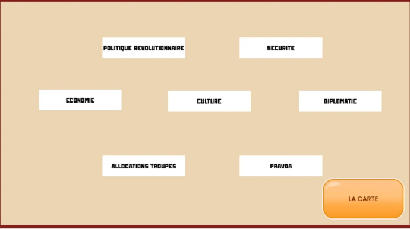
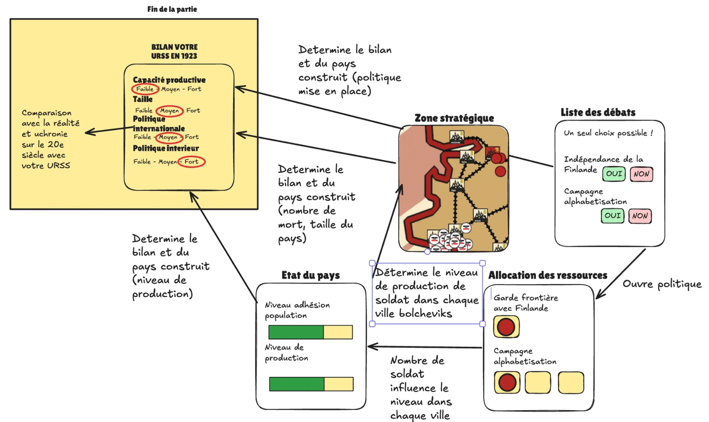
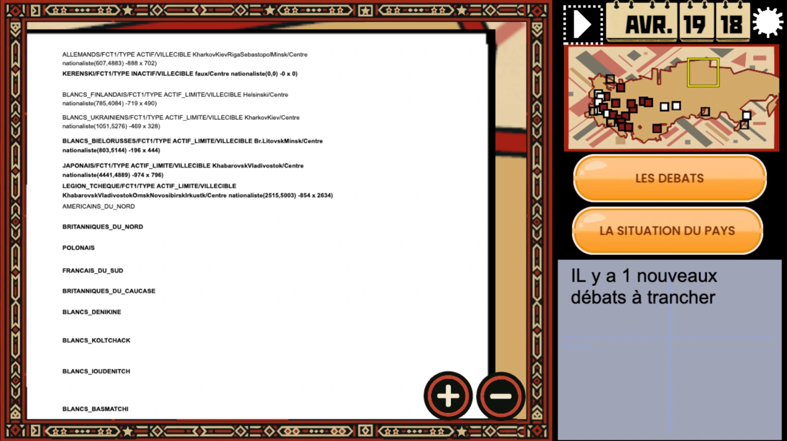

Bonjour à toutes et à tous,

Voici un petit retour sur le travail réalisé durant le mois de mai 2026 sur **Russia 1917**.

Le développement avance bien, et je suis particulièrement motivé en ce moment. Ce mois-ci, j’ai pu résoudre plusieurs questions importantes, notamment sur la manière de lier les choix militaires, politiques et économiques du joueur.

## Des choix stratégiques, politiques et économiques

L’un des grands défis du jeu est de faire sentir au joueur que chaque décision a un poids.

Dans **Russia 1917**, le joueur dirige le camp bolchevik au milieu d’une situation extrêmement instable : guerre civile, interventions étrangères, effondrement économique, famines, tensions nationales, débats idéologiques… Il ne s’agit donc pas seulement de déplacer des unités sur une carte. Il faut aussi gouverner un pays en crise.

## Le système des débats politiques

J’ai beaucoup travaillé ce mois-ci sur la question des débats politiques.

L’idée est simple : à certains moments, le joueur doit trancher de grandes questions politiques. Par exemple :

- faut-il accorder l’indépendance à la Finlande ?
- faut-il lancer une campagne d’alphabétisation ?
- faut-il signer l’armistice avec l’Allemagne ?
- faut-il durcir les réquisitions de grain ?
- faut-il prendre des mesures plus autoritaires contre les opposants ?

Je veux que le joueur puisse choisir entre plusieurs orientations politiques. Par exemple, certaines décisions peuvent rendre les armées blanches plus agressives. D’autres peuvent influencer la capacité de production ou le niveau d’adhésion de la population.

Mais je veux aussi éviter un problème classique dans le jeu : si toutes les décisions positives sont gratuites, le joueur va simplement tout activer dès le début.

Il faut donc que chaque choix ait un coût.

Ce coût peut prendre plusieurs formes.

Le joueur ne peut trancher qu’une seule décision par mois. Il devra choisir ses priorités du moment. Se concentre-t-il sur l’indépendance de la Finlande ou sur l’allocation des ressources ? Le joueur peut décider de renforcer l’armée, mais il risque alors de négliger la construction du nouveau régime. À l’inverse, il peut investir dans des politiques sociales ou administratives, mais cela réduit les ressources disponibles pour la guerre.

Si le joueur ne choisit aucune mesure politique pendant le mois, le jeu pourra soit ne rien activer, soit déclencher certains événements en fonction de variables internes. L’objectif est que le pays continue à vivre, même lorsque le joueur hésite ou se concentre uniquement sur le front.

Ensuite, une fois qu’une politique est activée, il faut lui allouer des ressources. Lancer une grande campagne d’alphabétisation, organiser des réquisitions ou renforcer une administration locale demande des hommes, des officiers, du matériel et du temps. Ces ressources ne sont alors plus disponibles pour le front. L’allocation de chaque politique peut être modifiée à n’importe quel moment, mais elle a chaque fois des conséquences.

Autrement dit, le joueur ne choisit pas seulement une idée politique abstraite. Il doit aussi décider s’il est prêt à y consacrer une partie de ses moyens.

Cela permet de créer de vrais dilemmes.

## Trois types de décisions pendant la partie pour faire un bilan

Le schéma ci-dessus résume assez bien la logique que je veux mettre en place.

Pendant une partie, le joueur devra régulièrement prendre trois types de décisions.

Il y a d’abord les choix stratégiques : attaquer une ville, défendre une région, produire une unité, décider quel ennemi affronter en priorité.

Il y a ensuite les choix politiques : adopter une ligne plus conciliante ou plus autoritaire, accorder ou refuser certaines revendications nationales, investir dans l’éducation, la propagande ou l’administration.

Enfin, il y a les choix économiques : où placer les ressources limitées du régime ? Dans l’armée ? Dans les politiques intérieures ? Dans la production ? Dans le contrôle des frontières ?

Ces décisions influencent directement la situation du camp bolchevik pendant la partie. Mais elles sont aussi conservées dans la mémoire du jeu.

À la fin, le joueur ne reçoit donc pas seulement un score militaire. Le jeu produit aussi un bilan politique, économique et social de l’État qu’il a construit.

A-t-il créé un pays stable ? Un pays vaste mais ruiné ? Un régime militairement victorieux mais politiquement isolé ? Une Russie soviétique réduite géographiquement, mais plus cohérente ? C’est ce genre de résultats que je veux rendre possible. J’y joindrai également un scénario uchronique expliquant comment votre URSS aura influencé le XXe siècle et le monde.

L’objectif final est qu’une partie d’environ une heure puisse mener à des scénarios très différents selon les priorités du joueur.

## Tester les conséquences de chaque décision avec les statistiques

Pour l’instant, je travaille surtout sur les effets concrets de chaque décision.

Il faut déterminer comment chaque choix modifie la production, les ressources disponibles, le niveau d’adhésion de la population, la capacité militaire ou encore la taille du pays contrôlé.

Cela demande aussi une série de calculs statistiques. L’idée est de simuler de nombreuses situations simplifiées pour vérifier que le jeu ne produit pas de résultats absurdes.

Par exemple, il faut éviter qu’une politique soit toujours trop rentable, ou qu’une autre soit systématiquement inutile. Il faut aussi vérifier que les ressources demandées restent cohérentes avec l’échelle du jeu.

J’appelle ça, avec humour, l’économie du jeu : le moment où je mets les idées politiques dans un tableur pour voir si elles tiennent debout.

## Communiquer les décisions dans la Pravda pour l’immersion

J’ai aussi travaillé sur la manière de présenter les décisions prises par le joueur.

_On peut évidemment zoomer et se déplacer sur la "Une" du journal_

Plutôt que de tout afficher sous forme de tableaux ou de fenêtres techniques, j’ai voulu donner une forme plus immersive aux annonces politiques. Les grandes décisions du joueur seront donc présentées sous la forme d’une « une » de la **Pravda**, le journal officiel des bolcheviks, dont le nom signifie « la vérité » en russe.

Je me suis inspiré de la mise en page de l’époque — on voit les prix en roubles et la véritable adresse de l’époque —, tout en l’adaptant à une lecture sur smartphone.

Le résultat fonctionne très bien. C’est lisible, immersif, et cela donne vraiment l’impression que les décisions du joueur deviennent des événements historiques.

À terme, j’aimerais même adapter la mise en page de la **Pravda** selon les années, car le journal a évolué graphiquement entre 1917 et 1922. Mais c’est un petit détail que je garde pour plus tard.

## Résolution de bugs et amélioration de l’IA ennemie

Ce mois-ci, j’ai également retravaillé l’intelligence artificielle des ennemis, notamment celle des armées blanches et des forces étrangères.

Chaque IA dispose maintenant de deux variables principales.

La première est son niveau d’agressivité : l’ennemi peut être inactif, actif_limité à une région ou actif_expansionniste.

La seconde est sa zone de progression : certains ennemis peuvent intervenir sur toute la carte, tandis que d’autres restent limités à certaines régions.

Ce système me permet de mieux représenter les comportements historiques tout en laissant de la place aux scénarios alternatifs.

Par exemple, les Allemands peuvent rester relativement neutres entre octobre 1917 et janvier 1918. Mais selon les décisions du joueur, ils peuvent ensuite devenir inactifs ou, au contraire, lancer une offensive à l’ouest de la Russie, comme ils l’ont fait historiquement après l’échec des négociations de Brest-Litovsk.

De la même manière, je peux contrôler les ambitions territoriales de chaque faction. Les Japonais vont-ils rester en Extrême-Orient ? Ou vont-ils tenter de progresser beaucoup plus loin ?

Pour suivre tout cela en temps réel pendant mes tests, j’ai créé un tableau directement sur la carte du jeu. Il me permet de voir rapidement le comportement de chaque camp et de repérer les problèmes.

## Conclusion

Voilà pour ce mois de mai 2026.

Le développement avance bien. Les systèmes commencent à mieux s’articuler entre eux : la guerre, la politique, l’économie et le bilan final du pays ne sont plus des éléments séparés, mais les différentes faces d’un même problème.

C’est exactement ce que je veux faire avec **Russia 1917** : un jeu où gagner la guerre ne suffit pas forcément, parce qu’il faut aussi décider quel pays on construit au milieu du chaos.

Le travail continue, et je suis très motivé pour la suite.
