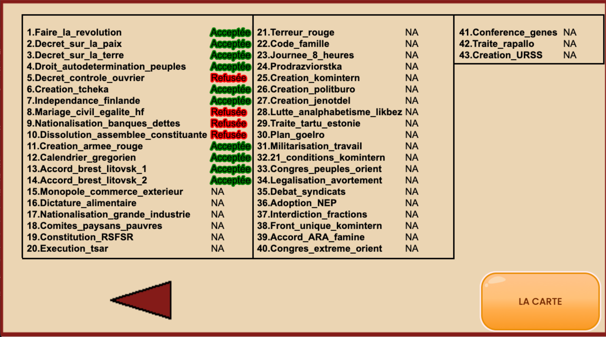

Bonjour,

Aujourd’hui, un article de blog un peu particulier, car je ne vais pas vous parler des nouvelles fonctionnalités que j’ai ajoutées dans le jeu, mais plutôt de mes doutes et de mes hésitations.

Durant ce mois d’avril, j’ai passé mon temps à résoudre des bugs techniques, surtout les combats entre Blancs (par exemple si les anarchistes ukrainiens rencontrent les généraux russes). Cela me confronte aux limites de l’outil GDevelop que j’utilise, mais je ne compte pas changer d’outil.

Ma situation est la suivante : de manière générale, j’ai aujourd’hui un jeu de stratégie mobile tout à fait honorable. On peut combattre des ennemis, prendre des villes, produire de nouvelles troupes en fonction des ressources disponibles, et l’ennemi dispose d’une intelligence artificielle correcte. Le tout dans une direction artistique inspirée de l’avant-garde soviétique, avec des formes simples, des triangles rouges et des cercles blancs rappelant le style soviétique d’avant-garde, tel que l’affiche d’El Lissitzky.

J’ai également ajouté une trame historique où les ennemis apparaissent aux dates réelles des batailles de la guerre civile russe (apparition des troupes japonaises en mars 1918, apparition des forces de Dénikine en juin 1918, etc.). On peut donc déjà rejouer l’histoire du côté bolchevique de manière relativement fidèle.

Mais ce n’est pas suffisant.

Déjà, le jeu est actuellement un jeu simple qui n’a qu’une seule fin possible, un seul chemin. Bref, rien de remarquable à part son design.

Mais aussi, le véritable cœur du projet, celui qui m’intéresse le plus, c’est la question politique. Actuellement, je suis face à un mur.

Mon idée de départ était relativement ambitieuse : intégrer 43 grands débats historiques auxquels les dirigeants soviétiques ont été confrontés entre 1917 et 1922 (donner l’indépendance à la Finlande, appliquer le communisme de guerre, changer le calendrier, etc.). À chaque fois, le joueur aurait pu valider chaque choix ou, au contraire, le refuser, et ainsi explorer des alternatives. L’objectif était simple : observer comment d’autres décisions politiques auraient pu modifier la situation stratégique immédiate… mais aussi le futur de l’Union soviétique. Ce qu’elle serait devenue.

Sur le papier, l’idée me semblait excellente.

Dans la pratique, elle pose un énorme problème de gameplay.

Quarante-trois débats, c’est extrêmement lourd pour un joueur sur mobile. Les événements finissent par défiler sans logique claire du point de vue du joueur. Les choix apparaissent surtout en fonction du contexte historique du moment, parfois presque « au hasard », et non parce que le joueur les recherche activement. Résultat : le système devient difficile à lire, fatigant et surtout peu agréable à jouer.

_Menu qui résume les choix fait par le joueur durant la partie_

Et c’est là que je me suis rendu compte d’une contradiction importante.

Bien sûr, les débats doivent apparaître dans leur contexte historique précis. Mais on ne peut pas non plus coller entièrement à la réalité si cela détruit le plaisir de jeu. Un jeu historiquement irréprochable, mais pénible à jouer, reste un mauvais jeu.

Et puis, j’ai aussi eu cette réflexion.

Je découvre, en fouillant les archives, le congrès panrusse sur l’éducation des adultes de mai 1919. Durant cette époque, alors que les batailles se succèdent, les bolcheviks trouvent le temps d’organiser un congrès sur l’éducation et la culture dans le but, évidemment, de renforcer l’adhésion de la population à leur combat. Et évidemment, cette réflexion ne faisait pas partie de mes 43 questions initiales.

Et cela montre bien la difficulté du projet : plus j’avance dans mes recherches historiques, plus je découvre de nouvelles dynamiques importantes qu’il faudrait intégrer au jeu.

Je dois donc probablement repenser entièrement la manière dont les choix politiques fonctionnent dans _Russia 1917_. Peut-être avec des thématiques qui regroupent les principaux débats. Je ne sais pas encore.

Bref, je suis en train de me demander comment intégrer la complexité de toute cette politique sans la rendre trop complexe pour le joueur. Et c’est vraiment compliqué.

Voilà où j’en suis.

À bientôt.
