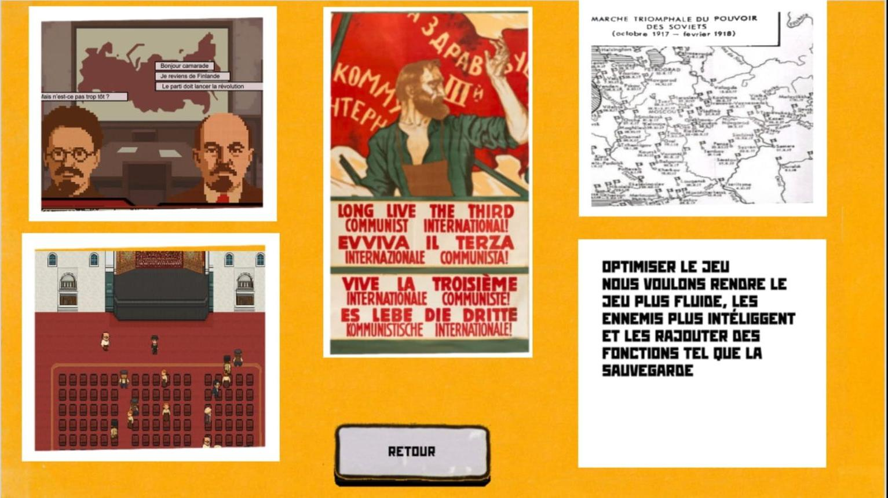
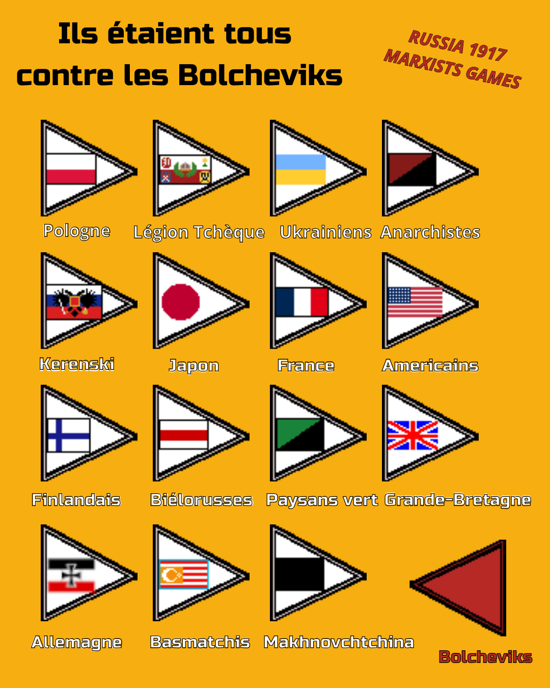

Voici un nouveau point sur le développement de Russia 1917. Le mois de novembre a été particulièrement dense, avec des progrès à la fois sur l’interface, le contenu historique et l’intelligence artificielle.

## 🌐 Mise à jour de la page d’accueil

La page d’accueil du jeu a été retravaillée :

- Les boutons sont désormais dynamiques pour offrir une interface plus vivante.
- Un nouveau menu présente les fonctionnalités prévues pour les futures versions, afin de mieux guider les visiteurs dans l’évolution du projet.

## ⚔️ Ajout des 21 camps ennemis

Les Bolcheviks devront désormais faire face à 21 forces opposées, reflétant la complexité de la guerre civile et des interventions étrangères.

Voici la liste complète :

- Les Allemands
- Les Américains du Nord (troupes arrivées à Mourmansk et Arkhangelsk)
- Les nationalistes bourgeois biélorusses
- Les nationalistes bourgeois finlandais
- Les nationalistes bourgeois ukrainiens (distincts de la Makhnovchtchina)
- Les Britanniques (qui interviennent dans deux zones differentes, le Nord de la Russie et le Caucase)
- Les Français (troupes française débarqué à Odessa)
- Les Japonais (intervention à Khabarovsk)
- La Légion tchèque (révoltée à Omsk, cherchant à rejoindre Vladivostok)
- Les nationalistes bourgeois polonais
- Les armées blanches de Dénikine
- Les armées blanches de Koltchak
- Les armées blanches de Ioudenitch
- Les Basmatchis (révoltés au Kazakhstan)
- Les anarchistes de Kronstadt
- La Makhnovchtchina, les anarchistes Ukrainiens
- Les Verts (paysans opposés à la politique du “Communisme de guerre”)
- Les Baltes (bourgeoisie d’Estonie, Lituanie, Lettonie,)
- Les forces restées fidèles au gouvernement Kerenski

Pour des raisons de gameplay, toutes ces factions sont considérées comme des « Blancs » par l’ordinateur.

Historiquement, cela mêle des mouvements très différents — par exemple les anarchistes de Kronstadt et les troupes de Koltchak sont identifiées comme “blanches” toutes les deux et ne combattent pas entre elles. Ce n’est sans doute pas très juste historiquement mais cette simplification permet de garder un gameplay lisible et simple pour le joueur.

Des illustrations ont également été intégrées pour différencier visuellement toutes ces troupes.

## 🧩 Structure interne : comment apparaissent les troupes ?

Pour gérer l’apparition et la disparition des unités, nous avons conçu un grand tableau de 85 lignes, représentant chaque mois de la guerre civile.

Chaque ligne contient :

- les nouvelles troupes qui entrent en jeu,
- celles qui doivent disparaître,
- les événements historiques associés.

Le programme parcourt ce tableau à chaque début de mois pour faire évoluer la situation.

Mais ce tableau n’est pas figé :

Il se modifie dynamiquement selon les décisions du joueur.

✦ Exemple : l’indépendance de la Finlande

- Si le joueur accepte l’indépendance finlandaise (comme dans l’Histoire), les Allemands interviennent immédiatement pour soutenir les bourgeois finlandais.
- S’il refuse, on peut supposer que l’intervention allemande serait arrivée plus tard : → dans ce cas, la ligne du tableau correspondante est déplacée à une autre date.

Ce système permet de modifier la chronologie historique ou d’en créer une nouvelle, tout en restant simple et flexible.

## 🧠 Améliorations de l’IA « Blanche »

L’IA est désormais organisée en quatre grandes fonctions, chacune jouant un rôle précis.

### 1️⃣ Fonction « Décision du mois »

Au début de chaque mois, l’IA vérifie dans ce tableau dynamique:

- quelles troupes doivent apparaître,
- lesquelles doivent être retirées,
- quels événements sont activés.

### 2️⃣ Fonction « Information »

L’IA analyse ensuite la situation globale :

- nombre total de troupes,
- nombre d’alliés proches,
- nombre d’ennemis proches,
- villes contrôlées,
- villes alliées proches,
- position de la troupe bolchevique la plus proche,
- ville ennemie ou neutre la plus proche.

Cette étape crée une sorte de « carte mentale » permettant aux IA de prendre des décisions cohérentes.

### 3️⃣ Fonction « Action »

À partir des informations recueillies, l’IA choisit une stratégie :

- attaquer une troupe ennemie,
- attaquer une ville,
- ou au contraire rester sur place pour défendre.

Un soldat (souvent le plus proche de la cible) reçoit alors un ordre clair.

Les factions nationalistes ont néanmoins une zone d’action limitée pour éviter des situations absurdes (ex : des Japonais à Varsovie).

### 4️⃣ Fonction « Création de troupes »

L’IA évalue si elle a besoin de renforcer ses effectifs.

Elle décide alors d’en créer ou non, en tenant compte :

- du rapport de forces alliés / ennemis,
- d’une part d’aléatoire pour humaniser son comportement

Finalement, la division entre plusieurs IA permet de donner des vitesses différentes à chaque fonction.

L' IA information tourne à chaque seconde pour donner une mise à jour en temps réel de la présence des ennemis.

L’IA action tourne moins souvent car elle nécessite plus de calcul et va agir en fonction du contexte et des objectifs.

Par exemple, elle peut attendre de voir si son action précédente a fonctionné avant d’en commencer une nouvelle.

### ⚙️ Optimisation

La prochaine étape consiste à simplifier et optimiser ces calculs pour éviter tout ralentissement.

Le but est de trouver un équilibre entre :

- réactivité,
- temps de calcul,
- comportement crédible de l’IA.

Si l’IA réagissait trop vite, elle enverrait toutes ses troupes dès la première seconde, ce qui rendrait les batailles très difficiles ou trop simples.

Nous travaillons donc à un comportement plus naturel et surtout changeant

🤝 Communauté

Un Discord dédié a été créé : “Marxist Games – Russia 1917”

Il servira à recueillir vos retours, proposer des idées, tester des fonctionnalités et échanger sur l’histoire de la Révolution et de la guerre civile.
